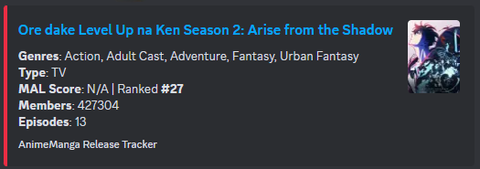
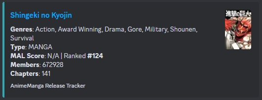

# **AnimeManga Release Tracker**  

🫠 **AnimeManga Release Tracker** is a Python-based automation tool that **fetches new anime episode and manga chapter releases** from **MyAnimeList** and **sends rich notifications** to a Discord webhook.  

## 🔹 **Features:**  
- [x] **Tracks both Anime & Manga**   
- [x] **Anime Genres & Type** (TV, Movie, OVA)   
- [x] **Next Episode Countdown** (Time left until release)   
- [x] **Localized Time Conversion** (UTC → Local Time)   
- [x] **Popularity Stats** (Score, Rank, Members)   
- [x] **Sends Rich Discord Messages** with **random embed colors**  
- [x] **Avoids Duplicate Notifications** 

## Setup & Installation 

### Clone the Repository
```bash
git clone https://github.com/nayandas69/AnimeManga-Release-Tracker.git
cd AnimeManga-Release-Tracker
```

### Install Dependencies
```bash
pip install -r requirements.txt
```


## Setting Up Repository Secrets in GitHub 

Instead of using a `.env` file locally, you can store **API keys securely** in **GitHub Secrets**.  

### Go to Your GitHub Repository  
- Open your **GitHub repository**  
- Click on **Settings**  
- Scroll down to **"Secrets and variables" → "Actions"**  

### Add Secrets 
Click **"New repository secret"** and add the following:  

| Secret Name          | Value (Example)             |
|----------------------|----------------------------|
| `MAL_CLIENT_ID`     | `your_mal_client_id_here`  |
| `DISCORD_WEBHOOK`   | `your_discord_webhook_url` |

### Use Secrets in GitHub Actions
The workflow **automatically loads** these secrets:  
```yaml
env:
  MAL_CLIENT_ID: ${{ secrets.MAL_CLIENT_ID }}
  DISCORD_WEBHOOK: ${{ secrets.DISCORD_WEBHOOK }}
```

🔹 **How to get `MAL_CLIENT_ID`?**  
- Go to [MyAnimeList API](https://myanimelist.net/apiconfig)  
- Create an **application**  
- Copy your **Client ID**  

🔹 **How to get `DISCORD_WEBHOOK`?**  
- Go to your **Discord server settings**  
- Create a **new webhook** in a channel  
- Copy the **Webhook URL**  


## Running the Script  
```bash
python src/tracker.py
```
This will fetch **new anime episodes & manga chapters** and send notifications to **Discord**.  

💖 **Enjoy & Star ⭐ this project if you find it useful!**

## Example Discord Notification



